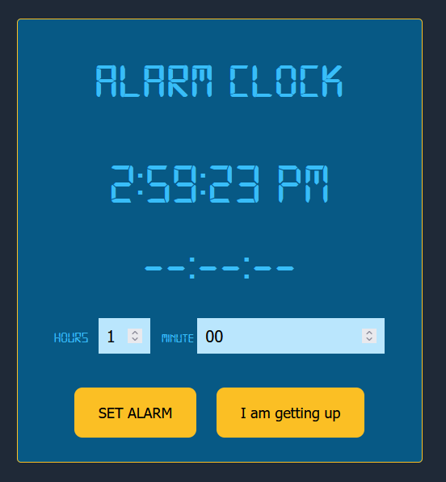

# Alarm Clock

> This project is of setting the alarm.

## Built With

- HTML
- CSS3
- JavaScript

## Workflow screen

## Live Demo (if available)

[Live Demo Link](not available)

## Getting Started

To get a local copy up and running follow these simple example steps.

### Prerequisites

Clone or fork the project to get it on your local system.

👤 **Aryan Bramhane**

- GitHub: [@aryan bramhane](https://github.com/neutr0n420)
- Twitter: [@twitterhandle](https://twitter.com/twitterhandle)
- LinkedIn: [LinkedIn](https://linkedin.com/in/linkedinhandle)

## 🤝 Contributing

Contributions, issues, and feature requests are welcome!

Feel free to check the [issues page](https://github.com/neutr0n420/alarm-clock/issues).

## Show your support

Give a ⭐️ if you like this project!

## Acknowledgments

- Hat tip to anyone whose code was used
- Inspiration
- etc